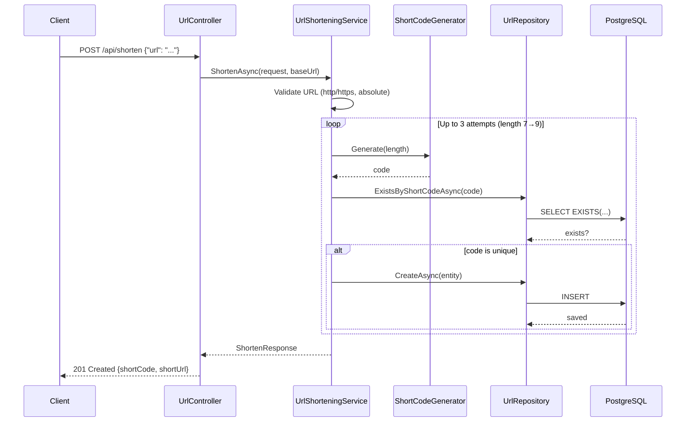
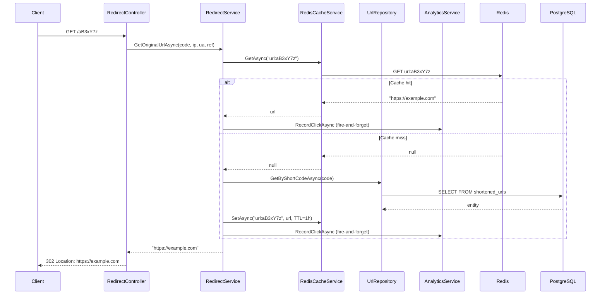
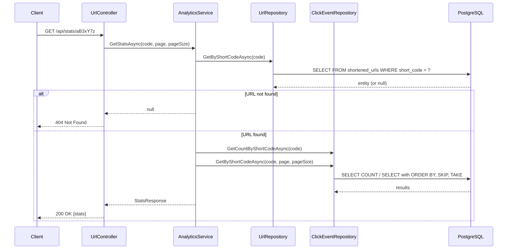

# Architecture Overview

URL Shortener Service — .NET 8 / ASP.NET Core / PostgreSQL / Redis

---

## System Architecture

The service is a **layered monolith** — a single ASP.NET Core 8 Web API process with clean layer separation enforced by namespace conventions rather than project boundaries. This is appropriate for a focused, single-domain service at this scale and time constraint.

```
┌────────────────────────────────────────────────────────────┐
│                       Client (Browser / curl)               │
└────────────────────────────┬───────────────────────────────┘
                             │ HTTP
┌────────────────────────────▼───────────────────────────────┐
│                    ASP.NET Core Host                        │
│                                                             │
│  ┌─────────────────────────────────────────────────────┐   │
│  │                  Middleware Pipeline                  │   │
│  │  ExceptionHandlingMiddleware → CorrelationIdMiddleware│   │
│  │  → SerilogRequestLogging → RateLimiter               │   │
│  └───────────────────────┬─────────────────────────────┘   │
│                          │                                   │
│  ┌───────────────────────▼─────────────────────────────┐   │
│  │                    Controllers                        │   │
│  │  UrlController          RedirectController            │   │
│  │  POST /api/shorten      GET /{code}                   │   │
│  │  GET /api/stats/{code}                               │   │
│  └───────────────────────┬─────────────────────────────┘   │
│                          │                                   │
│  ┌───────────────────────▼─────────────────────────────┐   │
│  │                     Services                          │   │
│  │  UrlShorteningService   RedirectService               │   │
│  │  AnalyticsService       RedisCacheService             │   │
│  │  ShortCodeGenerator                                   │   │
│  └──────────┬────────────────────────────┬─────────────┘   │
│             │                            │                   │
│  ┌──────────▼──────────┐   ┌────────────▼─────────────┐   │
│  │    Repositories      │   │       Cache Service       │   │
│  │  UrlRepository       │   │   RedisCacheService       │   │
│  │  ClickEventRepository│   │   (ICacheService)         │   │
│  └──────────┬──────────┘   └────────────┬─────────────┘   │
│             │                            │                   │
└─────────────┼────────────────────────────┼──────────────────┘
              │                            │
  ┌───────────▼───────────┐   ┌────────────▼──────────────┐
  │     PostgreSQL 16      │   │        Redis 7            │
  │  shortened_urls table  │   │  Cache-aside for redirects│
  │  click_events table    │   │  Rate limit counters      │
  └───────────────────────┘   └───────────────────────────┘
```

---

## Layer Descriptions

### Controllers (`UrlShortener.Api/Controllers/`)

Thin HTTP adapters. Controllers do exactly three things: extract inputs from the HTTP request, delegate to a service, and map the result to an HTTP response. No business logic lives here.

**`UrlController`** (`Controllers/UrlController.cs`)
- `POST /api/shorten` — accepts `ShortenRequest` JSON body, delegates to `IUrlShorteningService`, returns `201 Created` with `ShortenResponse`
- `GET /api/stats/{code}` — delegates to `IAnalyticsService`, returns `200 OK` with `StatsResponse` or `404`

**`RedirectController`** (`Controllers/RedirectController.cs`)
- `GET /{code}` — extracts IP, User-Agent, and Referer headers; delegates to `IRedirectService`; returns `302 Redirect` or `404`

Both controllers apply the `"fixed"` rate limiting policy via `[EnableRateLimiting("fixed")]`.

### Services (`UrlShortener.Api/Services/`)

Business logic layer. Each service has an interface (enabling mock injection in tests) and a single concrete implementation.

**`UrlShorteningService`** — validates that the URL is absolute and uses `http` or `https`; generates a 7-character Base62 code using `ShortCodeGenerator`; checks for collisions via `IUrlRepository.ExistsByShortCodeAsync`; retries up to 3 times with increasing length (7 → 8 → 9 characters); persists via repository; returns `ShortenResponse`.

**`RedirectService`** — cache-aside pattern: check Redis first (`ICacheService.GetAsync`); on miss, query `IUrlRepository.GetByShortCodeAsync` and populate the cache; fire-and-forget click recording via `Task.Run` to avoid adding latency to the redirect path.

**`AnalyticsService`** — `RecordClickAsync` builds a `ClickEvent` entity and delegates to `IClickEventRepository.RecordClickAsync`; `GetStatsAsync` queries both the URL record and the click count + paginated click list, returning a `StatsResponse` DTO.

**`RedisCacheService`** — wraps `StackExchange.Redis.IDatabase` for string get/set/remove. All Redis operations are wrapped in `try/catch` — on failure, the method logs a warning and returns `null` (get) or silently continues (set/remove). This is the graceful degradation path: if Redis is unavailable, redirects continue to work via PostgreSQL alone.

**`ShortCodeGenerator`** — static utility. Generates a random string of a given length from the Base62 alphabet (`a-zA-Z0-9`). Uses `System.Security.Cryptography.RandomNumberGenerator.GetInt32` — cryptographically secure, not `System.Random`.

### Repositories (`UrlShortener.Api/Repositories/`)

Data access via Entity Framework Core. Interface-based for testability. All methods are async and accept `CancellationToken`.

**`UrlRepository`** — `GetByShortCodeAsync` (AsNoTracking read), `CreateAsync` (sets `CreatedAt` to `UtcNow`, saves), `ExistsByShortCodeAsync` (AnyAsync for collision check).

**`ClickEventRepository`** — `RecordClickAsync` (sets `ClickedAt` to `UtcNow`, saves), `GetByShortCodeAsync` (paginated, ordered newest-first), `GetCountByShortCodeAsync` (LongCount for bigint result).

### Middleware (`UrlShortener.Api/Middleware/`)

**`ExceptionHandlingMiddleware`** — outermost middleware. Catches all unhandled exceptions and maps them to RFC 7807 `ProblemDetails` responses with appropriate status codes: `ArgumentException` → 400, `KeyNotFoundException` → 404, `InvalidOperationException` → 409, everything else → 500. No stack traces are included in responses.

**`CorrelationIdMiddleware`** — reads `X-Correlation-Id` from the incoming request, or generates a new UUID if absent. Stores the ID in `HttpContext.Items` and echoes it in the response header. Pushes the value into Serilog's `LogContext` so every log line for the request includes the correlation ID.

### Data (`UrlShortener.Api/Data/`)

**`AppDbContext`** — EF Core `DbContext` with two `DbSet`s: `ShortenedUrls` and `ClickEvents`. Entity configurations are discovered automatically via `ApplyConfigurationsFromAssembly`.

**EF configurations** (`Data/Configurations/`) — `IEntityTypeConfiguration<T>` implementations that set table names (snake_case), column names (snake_case), max lengths, identity columns, and indexes. Table name conventions: `shortened_urls`, `click_events`.

**Migrations** (`Data/Migrations/`) — single migration `20261004145708_InitialCreate` creates both tables and all indexes. Migrations apply automatically on startup via `db.Database.MigrateAsync()` in `Program.cs`.

---

## Data Model

### `shortened_urls`

| Column | Type | Constraints | Notes |
|---|---|---|---|
| `id` | `integer` | PK, identity always | Internal surrogate key |
| `short_code` | `varchar(10)` | NOT NULL, unique index | 7-char Base62; 9-char max on collision retry |
| `original_url` | `varchar(2048)` | NOT NULL | Destination URL |
| `created_at` | `timestamp with time zone` | NOT NULL | Set to UTC on insert |

Indexes:
- `PK_shortened_urls` on `id`
- `AK_shortened_urls_short_code` (unique alternate key) on `short_code`
- `ix_shortened_urls_short_code` (unique) on `short_code`

### `click_events`

| Column | Type | Constraints | Notes |
|---|---|---|---|
| `id` | `bigint` | PK, identity always | bigint for high-volume inserts |
| `short_code` | `varchar(10)` | NOT NULL, FK | References `shortened_urls.short_code` |
| `clicked_at` | `timestamp with time zone` | NOT NULL | Set to UTC on insert |
| `referrer` | `varchar(2048)` | nullable | HTTP Referer header |
| `user_agent` | `varchar(512)` | nullable | User-Agent header |
| `ip_address` | `varchar(45)` | nullable | IPv4 or IPv6 (max 45 chars) |

Indexes:
- `PK_click_events` on `id`
- `FK_click_events_shortened_urls_short_code` (FK) on `short_code` (cascade delete)
- `ix_click_events_short_code_clicked_at` (composite) on `(short_code, clicked_at)` — supports paginated stats queries

### Entity Relationship

```
shortened_urls (1) ──── (N) click_events
  short_code [PK/UK]         short_code [FK]
```

The FK uses `short_code` as the join key (not `id`), which avoids a join column lookup on the hot redirect path when the FK is indexed.

---

## API Endpoint Reference

| Method | Path | Request | Response | Notes |
|---|---|---|---|---|
| `POST` | `/api/shorten` | `{"url": "..."}` | `201` `{"shortCode","shortUrl"}` | 400 for invalid URL |
| `GET` | `/{code}` | — | `302` `Location: <url>` | 404 for unknown code |
| `GET` | `/api/stats/{code}` | `?page=1&pageSize=100` | `200` stats JSON | 404 for unknown code |

All endpoints return `application/problem+json` for error responses.

All responses include `X-Correlation-Id` header.

Rate limit: 100 requests/minute per IP (fixed window). Excess returns `429`.

### Request / Response Schemas

**POST /api/shorten — Request**
```json
{
  "url": "https://www.example.com/long/path"
}
```

**POST /api/shorten — Response (201)**
```json
{
  "shortCode": "aB3xY7z",
  "shortUrl": "http://yourdomain.com/aB3xY7z"
}
```

**GET /api/stats/{code} — Response (200)**
```json
{
  "shortCode": "aB3xY7z",
  "originalUrl": "https://www.example.com/long/path",
  "totalClicks": 42,
  "clicks": [
    {
      "clickedAt": "2026-10-04T18:30:00+00:00",
      "referrer": "https://google.com",
      "userAgent": "Mozilla/5.0 ...",
      "ipAddress": "1.2.3.4"
    }
  ]
}
```

---

## Data Flow

### Shorten URL (POST /api/shorten)



### Redirect (GET /{code})



The `RecordClickAsync` call happens in a background `Task.Run` — the 302 response is sent before the database write completes. Error in the background task is logged but does not affect the redirect.

### Analytics Query (GET /api/stats/{code})



---

## Key Design Decisions

### 1. Layered Monolith over Microservices

**Decision:** Single ASP.NET Core project with namespace-enforced layers (Controllers → Services → Repositories).

**Rationale:** A URL shortener is a single-domain service. Splitting it into separate Shortening, Redirect, and Analytics microservices would add distributed systems complexity (service discovery, network retries, eventual consistency, separate databases) with no benefit at this scale. The assignment evaluates engineering judgment — choosing the simpler architecture that fully delivers is the correct call.

**Alternative (Approach B):** Three microservices communicating via HTTP/gRPC (URL lookups) and a message queue (analytics). Documented in DESIGN.md for future implementation if horizontal scale requires it.

### 2. 302 Redirect over 301

**Decision:** `Redirect()` in ASP.NET Core defaults to 302 (temporary).

**Rationale:** 301 (permanent) redirects are cached by browsers indefinitely. Once cached, subsequent clicks from that browser never reach the service — analytics data is lost and rate limiting cannot apply. 302 ensures every click hits the service.

**Trade-off:** Slightly slower for repeat visitors (no browser cache). Acceptable because URL shortener traffic is typically read-once or low-repeat.

### 3. Fire-and-Forget Click Recording

**Decision:** `Task.Run` in `RedirectService.RecordClickFireAndForget` — the 302 response returns before the click is written to the database.

**Rationale:** Redirect latency matters more than analytics completeness. A synchronous write to PostgreSQL adds ~5-20ms. On a hot URL, this compounds under load.

**Trade-off:** If the process crashes immediately after sending the redirect but before the background task completes, that click is lost. Acceptable for analytics (approximate counts are fine); would not be acceptable for billing or financial data.

### 4. Redis Cache-Aside for Redirects

**Decision:** Check Redis first on `GET /{code}`, populate cache on miss (TTL: 1 hour), fall back to PostgreSQL if Redis is down.

**Rationale:** URL traffic follows a power-law distribution — a small number of short codes get the vast majority of clicks. Caching the hot codes in Redis (sub-millisecond read) dramatically reduces PostgreSQL load. The fallback ensures availability even when Redis is unavailable.

**Trade-off:** Cache entries can become stale if a URL is updated or deleted (not in scope for this implementation). If URL editing were added, cache invalidation would need to be added to the write path.

### 5. Fixed-Window Rate Limiting

**Decision:** ASP.NET Core built-in `AddFixedWindowLimiter`, 100 requests/minute per IP.

**Rationale:** Built-in support requires no additional infrastructure. Fixed window is simple to reason about and sufficient for abuse prevention at prototype scale.

**Trade-off:** Burst traffic is possible at window boundaries (e.g., 100 requests at the end of minute 1 + 100 at the start of minute 2 = 200 within seconds). Sliding window or token bucket would prevent this but are more complex. Not a concern at prototype scale.

### 6. Crypto-Secure Code Generation

**Decision:** `RandomNumberGenerator.GetInt32` (from `System.Security.Cryptography`) over `System.Random`.

**Rationale:** Short codes that are predictable or guessable could allow enumeration attacks. Using a CSPRNG prevents statistical prediction. The Base62 alphabet (62^7 = ~3.5 trillion combinations) makes brute-force infeasible.

**Trade-off:** Slightly slower than `System.Random`. Irrelevant at this call frequency.

### 7. EF Core over Dapper

**Decision:** Entity Framework Core with Npgsql provider for all database access.

**Rationale:** EF Core's migration tooling (`dotnet ef migrations add`) generates and applies schema changes with a single command. For a service with simple CRUD queries, EF Core's generated SQL is fine. Dapper would provide more control but require manual migration management.

**Trade-off:** EF Core's generated SQL for complex queries can be suboptimal. For the paginated `click_events` query (ORDER BY + SKIP + TAKE), the generated SQL is efficient.

### 8. Graceful Redis Degradation

**Decision:** All `RedisCacheService` methods wrap Redis operations in `try/catch` and return `null` on failure.

**Rationale:** Redis is a performance enhancement, not a correctness requirement. The service must continue to function (with higher PostgreSQL load) if Redis is unavailable. This is a direct response to the "improve reliability" scenario.

**Trade-off:** On Redis failures, every redirect becomes a cold PostgreSQL read. Under heavy load with Redis down, PostgreSQL becomes the bottleneck. Acceptable as a failsafe — the service degrades gracefully rather than failing.

---

## Technology Choices

| Technology | Version | Why |
|---|---|---|
| ASP.NET Core 8 | 8.0 | LTS release, built-in rate limiting, minimal configuration overhead |
| PostgreSQL 16 | 16 | Reliable open-source RDBMS, excellent EF Core support via Npgsql |
| Redis 7 Alpine | 7 | Standard in-memory cache, StackExchange.Redis client is mature |
| Entity Framework Core | 8.0.11 | Migration tooling, LINQ queries, repository pattern fits naturally |
| Serilog | 9.0.0 | Structured logging with `LogContext` (correlation ID enrichment) |
| Polly | 3.0.0 | Resilience policies (referenced for future retry implementation) |
| Swashbuckle | 6.6.2 | Swagger UI for development-time API exploration |
| xUnit + Moq + FluentAssertions | current | xUnit is the .NET standard, Moq for interface mocking, FluentAssertions for readable assertions |

---

## Infrastructure

### Docker Compose (`docker-compose.yml`)

Three services with dependency ordering:

```
postgres (healthcheck: pg_isready)
    |
redis (healthcheck: redis-cli ping)
    |
app (depends_on: postgres healthy, redis healthy)
```

The `app` service waits for both `postgres` and `redis` to pass their health checks before starting. This prevents startup failures from timing issues.

Data persisted in named volumes (`postgres_data`, `redis_data`) — data survives container restarts but is destroyed on `docker compose down -v`.

### Dockerfile (`UrlShortener.Api/Dockerfile`)

Multi-stage build:

1. **Build stage** (`mcr.microsoft.com/dotnet/sdk:8.0`) — restores packages and publishes the Release build
2. **Runtime stage** (`mcr.microsoft.com/dotnet/aspnet:8.0`) — copies only the published output (no SDK, no source)

Security: creates and runs as a non-root `appuser`. The image does not run as root.

The app listens on port 8080 (`ASPNETCORE_URLS=http://+:8080`). Docker Compose maps this to host port 8080.

---

## Out of Scope

The following were explicitly excluded from this implementation:

- User authentication and accounts
- Admin dashboard or UI
- Custom short domains
- Bulk URL shortening
- URL editing or deletion (and associated cache invalidation)
- Distributed horizontal scaling
- CI/CD pipeline
- HTTPS/TLS termination (reverse proxy concern, not application concern)
- Health check endpoint with DB/Redis probes (planned Phase 6, not yet built)
- Custom alias support (planned Phase 5, not yet built)
- URL expiration (planned Phase 5, not yet built)

---

## Future Work: Approach B (Microservices)

If scale requirements demanded horizontal deployment, the service could be decomposed into three microservices:

- **Shortening API** — owns POST /api/shorten, the `shortened_urls` table
- **Redirect Service** — owns GET /{code}, Redis-heavy, optimized for sub-millisecond response
- **Analytics Service** — consumes click events from a message queue (RabbitMQ), owns `click_events` table

Inter-service communication: async messaging for click events (fire-and-forget, decoupled), synchronous gRPC or HTTP for URL lookups. Each service owns its own database. This enables independent scaling — the Redirect Service can scale to thousands of instances without affecting the Shortening API.

The current Approach A codebase is structured such that this decomposition is straightforward: the service boundaries (IUrlShorteningService, IRedirectService, IAnalyticsService) already align with the proposed microservice split.
